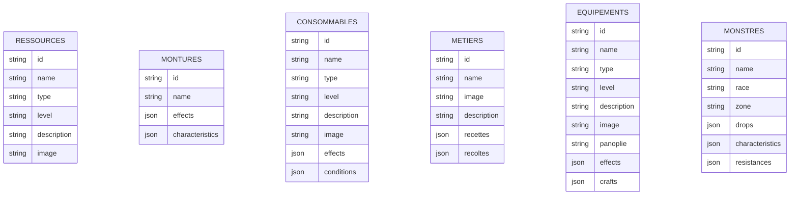
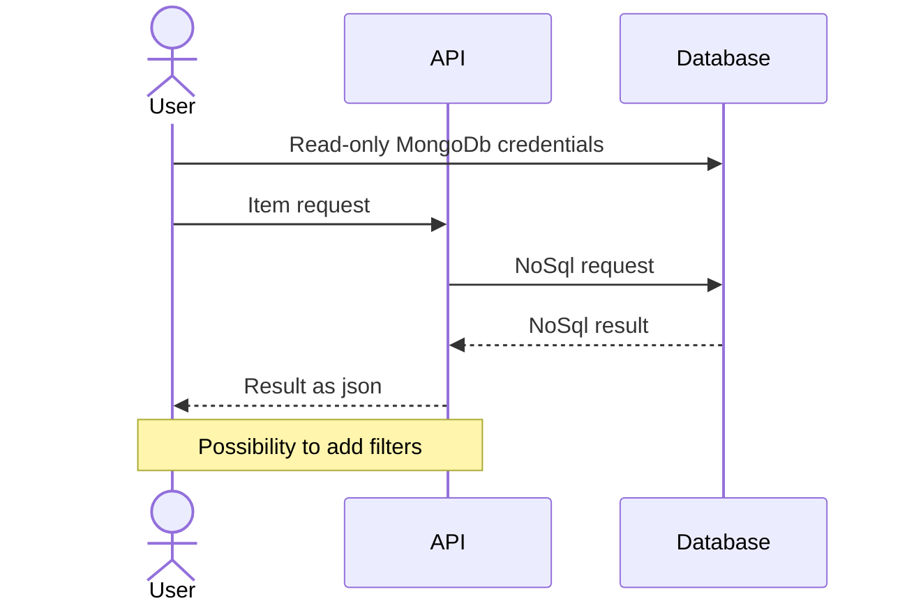
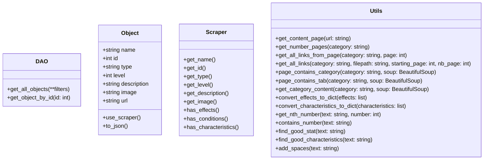

# Project
Project to create a NoSql database with the entire Dofus encyclopaedia, with the aim of creating an api.

# Quick Start
> :warning: You will need to have Docker installed and might need to run the docker commands with administrator privileges.

- Install poetry, with `pip install poetry`for instance.
- Install dependencies with `python -m poetry install`.
- Build the docker image for the database with `docker compose build`.
- Run the database with `docker compose up -d`.
- Run the app with `python src/app.py`.

When the app is running, you can find the API swagger on [http://0.0.0.0:8000/docs](http://0.0.0.0:8000/docs)

Once you're done using the app, you can run `docker compose down` to stop the docker container running the Mongo database. 

# How to use the app

Once you're on the swagger, you can get data from several categories of the Dofus game, which you can filter (all the filters available are listed in the swagger).

Let's say you're looking for a monster which drops some "Viande Goûtue", go on [http://0.0.0.0:8000/monstres/?drops=Viande%20Go%C3%BBtue](http://0.0.0.0:8000/monstres/?drops=Viande%20Go%C3%BBtue) to know what monster to farm to get your meat.

Now you're someone busy and you don't have time to go far away for your meat, you can also add a filter on the area to know where to find some tasteful meat in your area: [http://0.0.0.0:8000/monstres/?drops=Viande%20Go%C3%BBtue&zone=Temple%20de%20Kerubim](http://0.0.0.0:8000/monstres/?drops=Viande%20Go%C3%BBtue&zone=Temple%20de%20Kerubim)

# Run tests

You can run the project's tests with `python -m unittest discover src`.

# Roadmap

- [x] Ressources
- [x] Consommables
- [x] Montures
- [x] Métiers
- [ ] Familiers
- [ ] Panoplies
- [x] Equipements
- [ ] Armes
- [x] Bestiaire
- [ ] Classes
- [ ] Objets d'apparat
- [ ] Compagnon
- [ ] Havres-Sacs

# Database diagram

# Interaction diagram

# Class diagram (not done yet)

