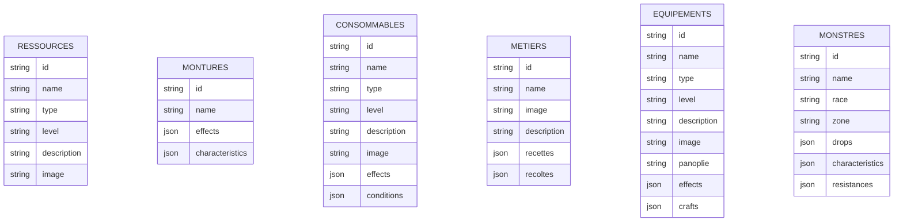
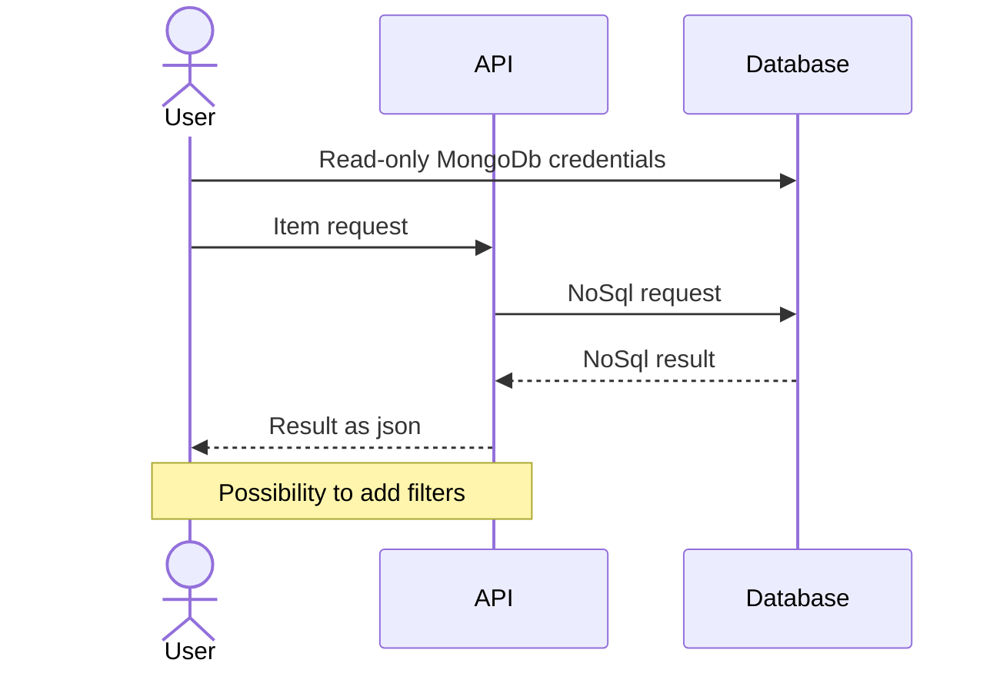
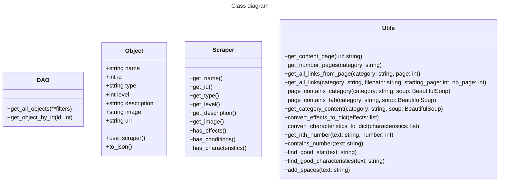

# Project
Project to create a NoSql database with the entire Dofus encyclopaedia, with the aim of creating an api.

# Quick Start
- Install poetry, with `pip install poetry`for instance.
- Install dependencies with `python -m poetry install`.
- Build the docker image with `docker compose build`.
- Run the app with `docker compose up`.

# Roadmap

- [x] Ressources
- [x] Consommables
- [x] Montures
- [x] Métiers
- [ ] Familiers
- [ ] Panoplies
- [x] Equipements
- [ ] Armes
- [x] Bestiaire
- [ ] Classes
- [ ] Objets d'apparat
- [ ] Compagnon
- [ ] Havres-Sacs

# Database diagram

# Interaction diagram

# Class diagram (not done yet)

