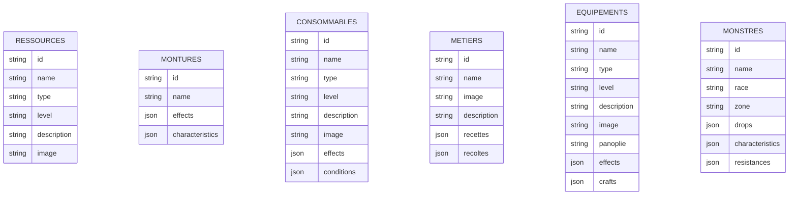

# Project
Project to create a NoSql database with the entire Dofus encyclopaedia, with the aim of creating an api.

# Quick Start

- Create a `.env` file, or rename the `.env.example` file to `.env`.
- Replace the MongoDb username and password with the credentials that have been provided to you.

# Roadmap

- [x] Ressources
- [x] Consommables
- [x] Montures
- [x] Métiers
- [ ] Familiers
- [ ] Panoplies
- [x] Equipements
- [ ] Armes
- [x] Bestiaire
- [ ] Classes
- [ ] Objets d'apparat
- [ ] Compagnon
- [ ] Havres-Sacs

# Database diagram

